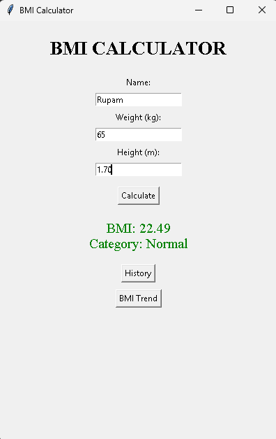
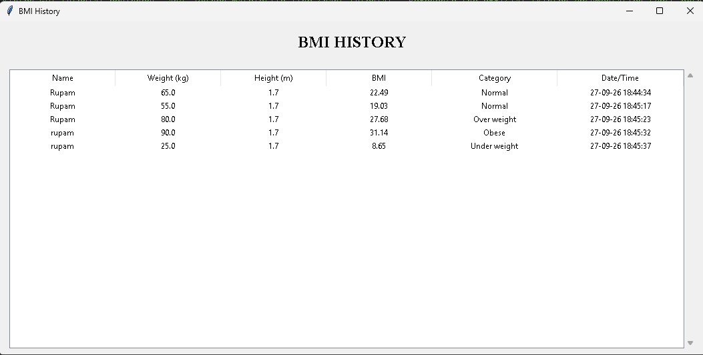
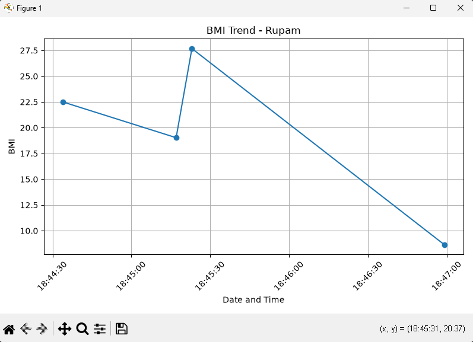

# BMI Calculator

A Python-based BMI Calculator developed as **Task 2** of the Oasis Infobyte Python Programming Internship (OIBSIP).

This project includes two implementations:

- **Beginner Version** — Command-line BMI calculator with input validation and BMI classification.
- **Advanced Version** — Tkinter GUI application with named-user support, SQLite database storage, BMI history, color-coded BMI results, and Matplotlib BMI trend visualization.

## ✨ Features

### Beginner Version
- Command-line BMI calculation
- Accepts weight in kilograms and height in meters
- Calculates BMI using the standard BMI formula
- Displays BMI rounded to 2 decimal places
- Classifies BMI into:
  - Underweight
  - Normal
  - Overweight
  - Obese
- Validates user input
- Rejects non-numeric, zero, and negative values

### Advanced Version
- User-friendly Tkinter graphical interface
- Named-user support
- Input validation and error handling
- Color-coded BMI category results
- SQLite database for storing BMI records
- Date and time stored with each BMI record
- BMI history displayed in a table
- Scrollable history view
- BMI trend visualization using Matplotlib
- Database read/write error handling


## 🛠️ Technologies Used

| Technology | Purpose |
|---|---|
| Python | Core programming language |
| Tkinter | Graphical user interface |
| SQLite | BMI record storage |
| Matplotlib | BMI trend visualization |
| Git | Version control |
| GitHub | Project hosting and collaboration |

## 📁 Project Structure

```text
Task_2_BMI_Calculator/
│
├── bmi_calculator_beginner.py
├── bmi_calculator_advanced.py
├── README.md
└── screenshots/
    ├── 01_bmi_calculator.png
    ├── 02_bmi_history.png
    └── 03_bmi_trend.png
```
## 📊 BMI Categories

| BMI Range | Category |
|---|---|
| Below 18.5 | Underweight |
| 18.5 – 24.9 | Normal |
| 25.0 – 29.9 | Overweight |
| 30.0 and above | Obese |

## ▶️ How to Run

### Beginner Version

Open a terminal in the `Task_2_BMI_Calculator` folder and run:

```bash
python bmi_calculator_beginner.py

```
The program will ask for:

- Weight in kilograms
- Height in meters

It will then calculate and display the BMI and corresponding category.

## Advanced Version

Open a terminal in the `Task_2_BMI_Calculator` folder and run:

```bash
python bmi_calculator_advanced.py
```

The advanced version opens a graphical interface where you can:

- Enter a user's name
- Enter weight and height
- Calculate BMI
- View the BMI category
- Save BMI records
- View historical records
- View a user's BMI trend

## 🔧 Advanced Version Details

The advanced version extends the basic BMI calculator into a complete GUI-based application.

### User Input
- User name
- Weight in kilograms
- Height in meters

### BMI Calculation
The BMI is calculated using:

```text
BMI = Weight / Height²
```

### Database Storage

BMI records are stored in an SQLite database with information including:

- User name
- Weight
- Height
- BMI
- BMI category
- Date and time

## BMI History

The application provides a history window where saved BMI records can be viewed in a structured table.

## BMI Trend

The application can generate a BMI trend graph for a selected user using Matplotlib.

## Error Handling

The application handles:

- Invalid numeric input
- Zero or negative weight/height
- Empty user names
- Database read errors
- Database write errors

## 🎓 Learning Outcomes

Through this project, I practiced and learned:

- Python functions and modular programming
- Conditional statements and input validation
- Exception handling using `try` and `except`
- GUI development using Tkinter
- Working with SQLite databases
- Executing SQL queries from Python
- Storing and retrieving persistent data
- Working with dates and timestamps
- Creating data visualizations using Matplotlib
- Handling database read/write errors
- Using Git and GitHub for version control
- Writing technical project documentation

## 🖼️ Screenshots

### BMI Calculator GUI



### BMI History



### BMI Trend




## 🎥 Demo Video

A complete demonstration of the BMI Calculator, including the GUI, BMI calculation, database history, and BMI trend visualization.

▶️ [Watch the BMI Calculator Demo on LinkedIn](https://lnkd.in/p/dwAy5dXY)