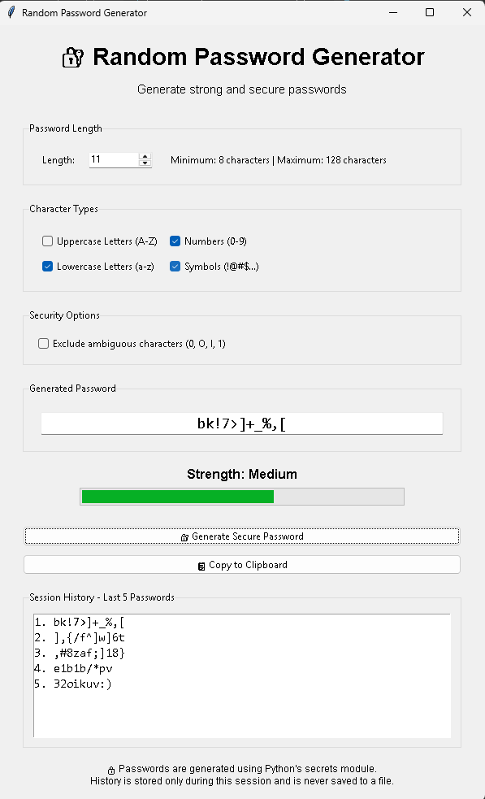
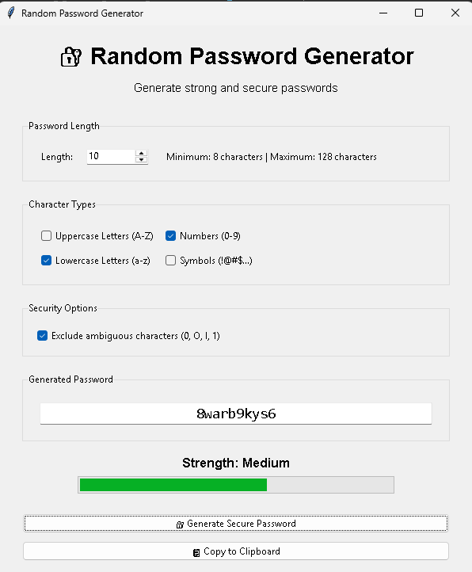
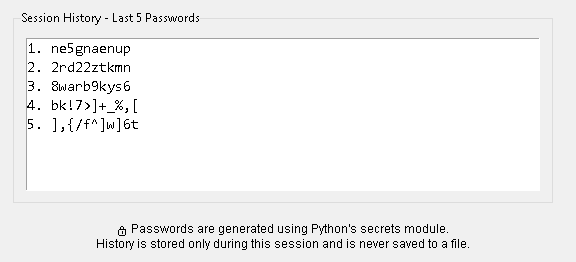

# 🔐 Random Password Generator

A Python-based **Random Password Generator** developed as part of my **Oasis Infobyte Python Programming Internship (OIBSIP)**.

This project includes both a **Beginner Command-Line version** and an **Advanced GUI version**. The application generates customizable passwords based on user-selected character types and includes security-focused features in the advanced version.

---

## 📌 Internship Task

**Internship:** Python Programming Internship  
**Organization:** Oasis Infobyte  
**Task:** Task 3 – Random Password Generator  
**Levels:** Beginner + Advanced  
**Language:** Python

---

## 🎯 Objective

The objective of this project is to build a password generator that allows users to:

- Specify the desired password length.
- Select the character types to include.
- Generate random passwords.
- Guarantee that selected character types are represented.
- Validate user input.
- Generate multiple passwords.
- Use cryptographically secure password generation in the advanced version.
- Copy generated passwords to the clipboard.
- Check password strength.
- Maintain a temporary session history.

---

# 📂 Project Versions

This project contains two versions:

### 🟢 Beginner Version

A command-line application designed to demonstrate fundamental Python concepts such as:

- Input handling
- Functions
- Loops
- Conditional statements
- Lists
- String manipulation
- Input validation
- Random character selection

### 🔵 Advanced Version

A graphical password generator built with Tkinter and enhanced with security and usability features such as:

- GUI interface
- Secure password generation using `secrets`
- Password strength indicator
- Clipboard integration
- Ambiguous-character exclusion
- Session history
- Guaranteed character-type inclusion

---

# ✨ Features

## 🟢 Beginner Version Features

### Character Type Selection

The user can select between **2 and 4 character types**.

| Input | Character Type |
|------|----------------|
| `U` | Uppercase letters |
| `L` | Lowercase letters |
| `N` | Numbers |
| `S` | Symbols |

Lowercase inputs are automatically converted to uppercase.

Example:

```text
u → U
l → L
n → N
s → S
```

### Input Validation

The program validates user input and prevents:

- Invalid character types
- Duplicate character type selections
- Fewer than 2 character types
- More than 4 character types
- Non-numeric input where numbers are required
- Password lengths below 8 characters


### Random Password Generation

The Beginner version uses Python's built-in random module to select characters from the selected character pools.

The generated password contains at least one character from every selected character type.

For example, if the user selects:

```
U + L + N
```
the generated password will contain at least:

- 1 uppercase letter
- 1 lowercase letter
- 1 number

The remaining characters are selected randomly from the combined character pool.


### Generate Another Password

The user can generate another password without restarting the application.
```
Y → Generate another password

N → Exit
```
## Advanced Version Features
### Graphical User Interface

The advanced version uses Tkinter to provide a graphical interface.

The GUI includes:

- Password length control
- Character type checkboxes
- Security options
- Generated password display
- Password strength indicator
- Generate button
- Copy to Clipboard button
- Password history


### Password Length Control

The advanced version provides a Spinbox for selecting password length.

Supported range:
```
8 – 128 characters
```

A minimum length of 8 characters is enforced.

### Character Type Selection

Users can select:

- Uppercase letters
- Lowercase letters
- Numbers
- Symbols

At least two character types must be selected.


### Cryptographically Secure Generation

Unlike the Beginner version, the Advanced version uses Python's:
```
secrets
```
module instead of:
```
random
```
The secrets module is designed for security-sensitive random values such as passwords and authentication tokens.

Example:
```
secrets.choice(character_pool)
```
This provides a more security-focused approach to password generation.


### Guaranteed Character-Type Inclusion

The Advanced version guarantees that at least one character from every selected character type appears in the generated password.

For example, if the user selects:
```
Uppercase
Lowercase
Numbers
Symbols
```
the generated password will contain at least:
```
1 uppercase character
1 lowercase character
1 number
1 symbol
```
The remaining characters are securely selected from the combined character pool.


### Password Strength Indicator

The application provides a visual password strength indicator:
```
Weak
Medium
Strong
```
Strength is determined using:

- Password length
- Character diversity

A progress bar is also displayed to provide a visual representation of the password strength.


### Copy to Clipboard

The Advanced version uses the:
```
pyperclip
```
module to copy generated passwords to the system clipboard.

The password is also automatically copied to the clipboard immediately after generation.

Users can additionally use the:
```
 Copy to Clipboard
```
button.

### Exclude Ambiguous Characters

The application provides an option to exclude characters that can easily be confused visually.

The excluded characters are:
```
0
O
l
1
```
This can make passwords easier to manually read and type.

### Password Generation History

The Advanced version maintains a temporary session history containing the last 5 generated passwords.

Example:
```
1. Xk8@pQ2#mL
2. aT9$Lm4!Zx
3. P7@vN2#qWs
4. mK5!rT8$Yp
5. Q2#xL9@Bn
```
#### Security Consideration

The history is stored only in memory during the current application session.

Passwords are:

- Not written to a file
- Not stored in a database
- Not persisted after the application closes


## Technologies Used
### Beginner
- Python
- random
- string
### Advanced
- Python
- secrets
- string
- tkinter
- pyperclip

## Project Structure
```
Task_3_Random_Password_Generator/
│
├── password_generator_beginner.py
├── password_generator_advanced.py
└── README.md
```

## How to Run
### 1. Check Python Installation

Open a terminal and run:
```
python --version
```
### 2. Open the Project Folder
```
cd Task_3_Random_Password_Generator
```
### 3. Run the Beginner Version
```
python password_generator_beginner.py
```

The command-line password generator will start.

### 4. Install the Advanced Version Dependency

The Advanced version uses pyperclip.
Install it using:
```
python -m pip install pyperclip
```
### 5. Run the Advanced Version
```
python password_generator_advanced.py
```
The graphical password generator will open.

## Example — Beginner Version

```
Enter how many character types you want to use: 3

====== CHARACTER TYPE MENU ======

Uppercase = U
Lowercase = L
Numbers   = N
Symbols   = S

Choose character type 1: U
Choose character type 2: L
Choose character type 3: N

Character types selected successfully!

Selected types: ['U', 'L', 'N']

Enter password length (minimum 8): 12

================================

Generated Password: G7mK2pQ9xR4a

================================

Generate another password? (Y/N): Y

Generated Password: aP8kL2xQ7mZ4

Generate another password? (Y/N): N

Thank you for using Password Generator!
```
The generated password will be different each time because the program uses random character selection.

## Program Logic — Beginner Version
```
Start
  ↓
Select number of character types
  ↓
Validate number (2–4)
  ↓
Select U / L / N / S
  ↓
Validate selections
  ↓
Prevent duplicate selections
  ↓
Create combined character pool
  ↓
Enter password length
  ↓
Guarantee one character from each selected type
  ↓
Generate remaining random characters
  ↓
Shuffle password characters
  ↓
Display password
  ↓
Generate another?
  ↓
Yes → Generate again
  ↓
No → Exit

```

## Program Logic — Advanced Version
```
Start
  ↓
Open Tkinter GUI
  ↓
Select password length
  ↓
Select character types
  ↓
Validate selections
  ↓
Select security options
  ↓
Build character pools
  ↓
Remove ambiguous characters if requested
  ↓
Guarantee one character from each selected type
  ↓
Generate remaining characters using secrets
  ↓
Securely shuffle password
  ↓
Calculate password strength
  ↓
Display password
  ↓
Automatically copy to clipboard
  ↓
Add password to session history
  ↓
Keep latest 5 passwords
  ↓
Wait for next generation
```
## 🖼️ Screenshots

### Random Password Generator GUI



### Security Options



### Password History




## 🎥 Demo Video


▶️ [Watch the Random Password Generator Demo on LinkedIn](https://lnkd.in/p/d3_-nQDD)

The demonstration shows:

Beginner version
Advanced GUI
Password generation
Password strength indicator
Security options
Clipboard functionality
Password history


## 👨‍💻 Author

**Rupam Ghosh**

Electronics & Communication Engineering Graduate  
Aspiring Embedded Systems & Robotics Engineer

### 🔗 Connect With Me

- GitHub: [Rupam4604](https://github.com/Rupam4604)
- LinkedIn: [Rupam Ghosh](https://www.linkedin.com/in/rupam-ghosh-0406047119326s)